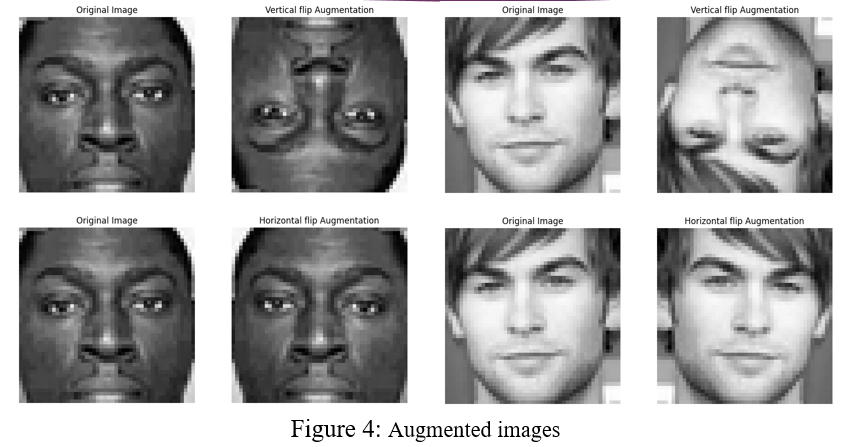
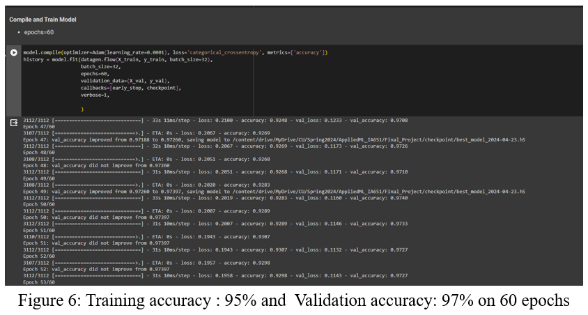
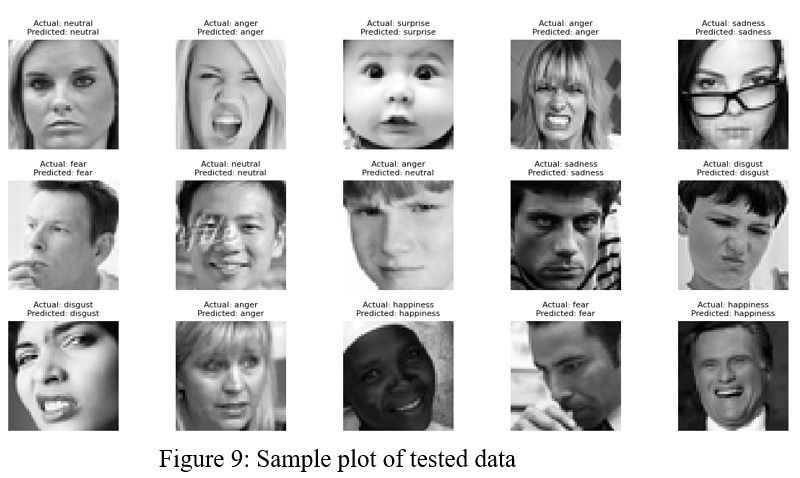

# Enhancing Facial Expression Recognition Using Class Imbalance Handling Techniques.

## 1) Dataset Description

The dataset used in this project is the Facial Expression Recognition 2013 (FER2013) dataset. It consists of 35,887 images of faces, each of size 48x48x1 (grayscale images) with seven categories of emotions: `anger, disgust, fear, happiness, sadness, surprise, and neutral` as shown in the figure Figure 1. 

The dataset was collected for the purpose of facial expression recognition research(FER) and is commonly used in the field. It is a publicly available [dataset on kaggle](https://www.kaggle.com/code/lxyuan0420/facial-expression-recognition-using-cnn/input). As shown in Figure 2, it is applicable in:
 - a) Biometric authentication: Access Control
 - b) Security and Surveillance 
 - c) Health care systems: FaceMe
 - d) Time and Attendance.
 - e) eKYC & Fintech

## 2) Prediction Objective

The goal of this project is to enhance facial expression recognition by addressing the challenge of class imbalance(Figure 3) within the FER2013 dataset. By improving the accuracy and generalizability of the model, we aim to make a high accuracy predictive model that can be used  in mental health analysis, and customer sentiment analysis in industries like retail and entertainment.

## 3) Process Overview

Throughout the project, we iteratively approached the challenge of class imbalance within the FER2013 dataset. We implemented oversampling of minority classes and data augmentation techniques to enhance the model's accuracy. Our experience involved experimenting with different preprocessing methods, architecture designs, and hyperparameter selections to optimize the performance of the facial expression recognition model through data preprocessing.

- Data Pre-processing  
    **Steps:**
    - Splitting dataset into 3 parts: Training: **80%**, Validation: **10%**& Testing: **10%** :Part 3 of  `preProcess_augment_oversample()`
    - Convert strings to lists of integers: Part 1 of  `preProcess_augment_oversample()`
    - Reshape to 48x48x1 and normalise grayscale images: Part 1 of   `preProcess_augment_oversample()`
    -  Perform one-hot encoding label, e.g. class 3 to [0,0,0,1,0,0,0]: Part 4 of `preProcess_augment_oversample()`
    - Oversampling minority classes : `preProcess_augment_oversample()`
    - Data augmentation(Figure 4): `preProcess_augment_oversample()`

## 4) Exploratory Data Analysis (EDA)

- **X and Y variables**: The features include facial key coordinates, while the target variable is the categorical expression label.
- **Observations**: The dataset consists of 35,887 observations.
- **Feature Distribution**: We focused on analyzing the distribution of features that are imbalanced or may pose challenges during model training.
- **Correlation**: We examined correlations between features to identify any strong relationships.
- **Feature Importance**: We explored feature selection and engineering techniques, including label encoding, one-hot encoding, and data augmentation.

## 5) Model Fitting 
- **Train/Test Splitting**: The dataset was split into `80%` training and `10%` testing sets using the  `preProcess_augment_oversample()` function.
- **Model Selection**: We selected a Convolutional Neural Network (CNN: `create_CNN_model()`) architecture for its effectiveness in image classification tasks.
- **Hyperparameter Selection**: We experimented with different hyperparameter values(`learning_rate=0.0001`, `Dropout(0.25)`, `batch_size=32`) and fine-tune the CNN model to get high accuracy model. 
- The CNN model architecture that gave a the best accuracy is as shown in Figure 5.

## 6) Training, Validation and Metrics
- **Training**: 

- **Metrics**: We weighed metrics such as accuracy, precision, recall, and F1-score to evaluate model performance.
- **Confusion Matrix**: We analyzed the confusion matrix to identify model weaknesses and areas for improvement. The confusion matrix of the final model is as shown below.

## 7) Prediction
- A 97.53% Testing accuracy was achieved using the augmented dataset on the CNN model as shown in Figure 8.

- Sample plot of tested data: Figure 9.
    

## 8) Conclusion

1) We have explored the significance of facial expressions in communication, emphasizing their nonverbal nature and universal presence across cultures.
2) We have mitigated class imbalance using oversampling and data augmentation techniques to enhance FER models accuracy.
3) We have attained promising results with training accuracy at 95%, validation accuracy at 97%, and testing accuracy of 97.53% on our FER CNN model using the FER2013 dataset.
4) We have elaborated the use of FER models across industries like biometric authentication, mental health analysis, surveillance systems and customer sentiment analysis in retail and entertainment.

**Hence improved accuracy such as the one in this project, provides  accurate FER predicting models for human-machine interactions and societal well-being.**

## Authors

**Leonel Akanji Akanji (MSc. ECE Clarkson University)**  
**Mst Rumana A Sumi (Phd. ECE Clarkson University)**
